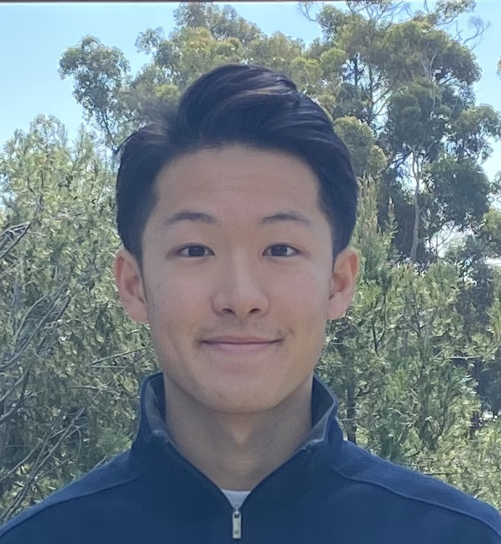
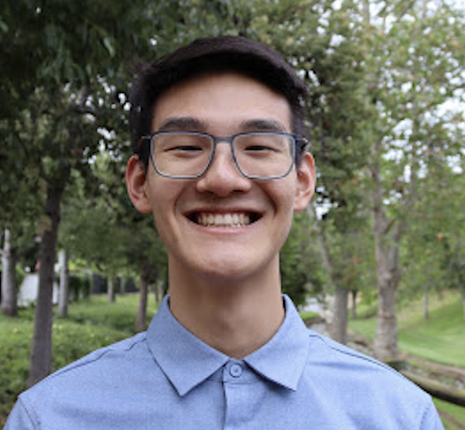

[Home](https://melinucsd.github.io/cse110-team16-tmpwebsite/) > About Us
# Who are we?
## Matias Lin

Hey! My name is Matias Lin and I am a junior Muir student studying Bioinformatics under the Computer Science department. I'm very passionate about the possibilities of machine learning in the area of personalized medicine.
 - [My Github Profile](https://github.com/matiaslin)  

## Lara Daneshgaran Bajastani
TODO  
## Shuhua Xie
TODO  
## Kevin Stubbings 
TODO  
## Samuel Liu

Hello! My name is Samuel Liu and I am a 2nd year Warren student studying Computer Science. I love cooking, growing plants, and playing games. 
 - [My Github Profile](https://github.com/samliu000)  

\

## Yuru Zhou

My name is Yuru Zhou, a second year undergraduate student majoring in Mathematics & Computer Science. I am interested in web & mobile app development, and passionate about creating innovative solutions for future technology.
 - [My Github Profile](https://github.com/xxwwyytt1)  

## Fengdi Liu
TODO  
  
## Joshue Aguirre

My name is Joshue Aguirre. I am a fourth year
Computer Science major. I enjoy listening to music and playing video games. 
- [My Github Profile](https://github.com/Yoshisham)
## Aven Huang

My name is Aven Huang, and I named myself after my dog, Evan, as you can see in my picture. I’m a sophomore student majoring in Data Science.
- [My Github Profile](https://github.com/xxwwyytt1)